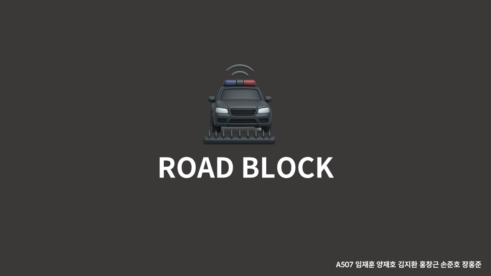
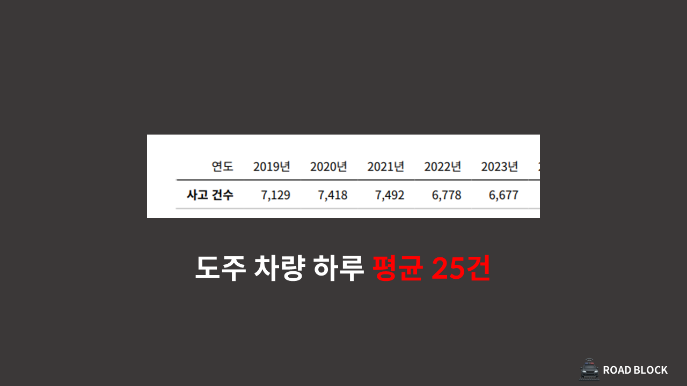
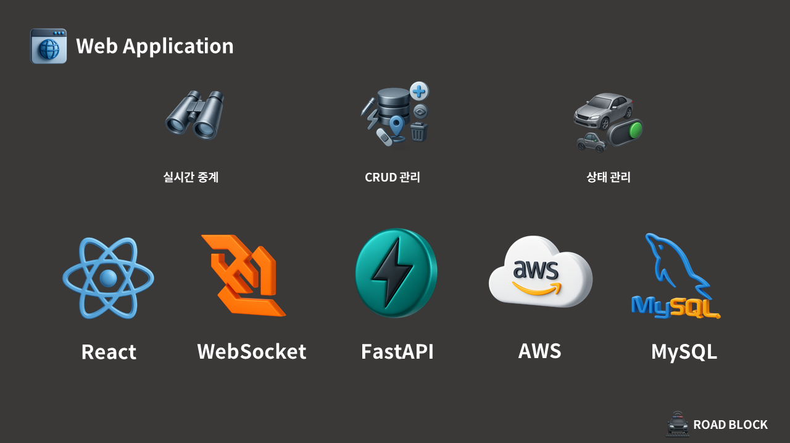
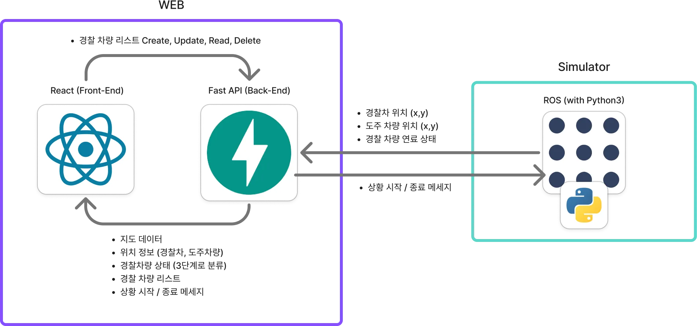
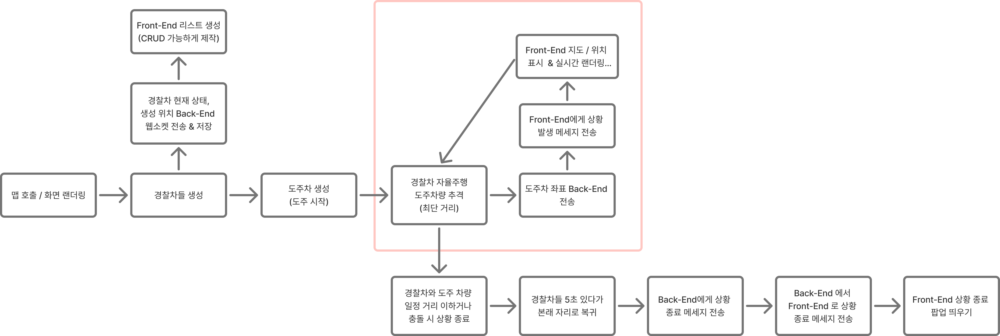
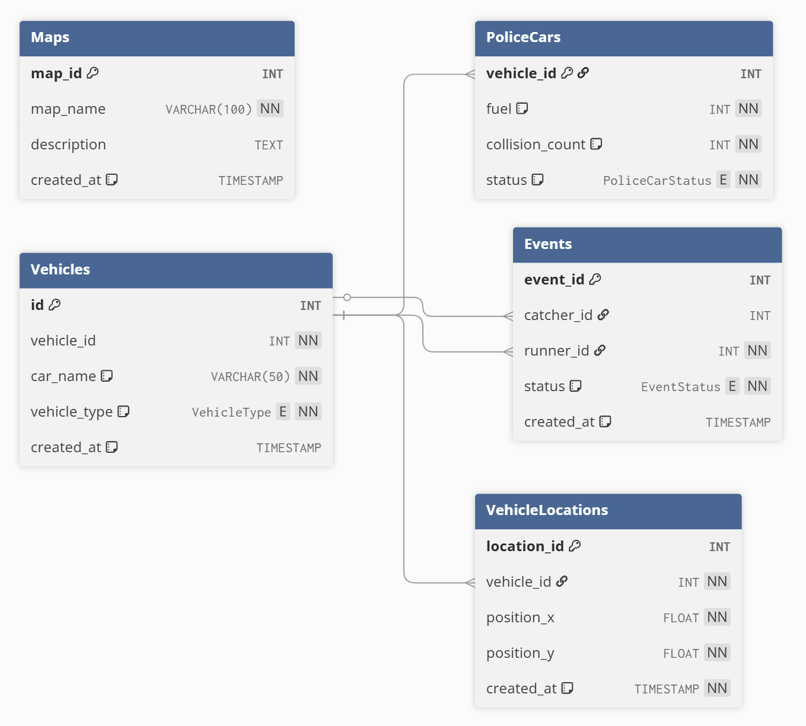

# 도주 차량 방지 시스템 - Road Block

도주 차량을 막는 경찰관 분들의 **안전을 보장해드리기 위해** 경찰차를 **자율 주행**하여 조직적으로 도주 차량을 막는 시스템 

[📓 기능 명세서](https://www.notion.so/262546b4de0280d3a988ea11e464ff57)   
[🗒️ API 명세서](https://magnificent-lighter-489.notion.site/API-262546b4de0280779251d4816ce29941?pvs=74) 
[🎨 Figma Lo-Fi 디자인](https://www.figma.com/design/654U42E22pFG5uiDIWTAFy/%ED%8A%B9%ED%99%94-%ED%8E%98%EC%9D%B4%EC%A7%80-%EB%A0%88%EC%9D%B4%EC%95%84%EC%9B%83-%EC%B4%88%EC%95%88?node-id=0-1&t=uAdzKVNnHfYwWz8f-1)

## 프로젝트 개요
자율주행 경찰차를 통한 도주 차량 실시간 추적/검거 모니터링 시스템입니다.  
본 프로젝트는 **도주 차량 추적 과정에서 발생하는 경찰 인명 및 재산 피해를 최소화**하기 위해 설계되었습니다.  
가상 시뮬레이션 환경을 기반으로 차량의 위치·상태·이벤트를 실시간으로 모니터링하며,  
실제 스마트 모빌리티·교통 관제 시스템 연구에 활용될 수 있는 프로토타입을 목표로 합니다.

## 🖐️ 프로젝트 소개

 

현재 대한민국에서 도주 차량 사고는 **하루 평균 25건** 정도 발생하는 통계가 있습니다. 
  

 

도주 차량 사고는 **챠량 충돌, 인명 피해**를 주었다는 조사 결과가 있었습니다. 지금까지는 경미한 **경찰관 부상** 다행히 없었지만, 이를 간과하기에는 경찰관 분들의 노고와 위험이 없다고는 할 수 없습니다.
  

 

이러한 문제점을 바탕으로 **경찰차를 자율주행** 시키고, 도주차량의 위치를 바탕으로 **군집 제어 기능**을 합쳐, 도주 차량을 사람이 직접 운전해서 쫓을 필요 없는 **Road Block** 시스템을 개밯하였습니다.
  

 
 

## 주요 기능

1. 실시간 차량 위치 추적
   - WebSocket을 통한 실시간 차량 위치 업데이트
   - OpenLayers 지도 상 마커 표시

2. 차량 상태 모니터링
   - 연료량, 파손상태 등 실시간 상태 확인
   - 차량별 필터링 및 검색

3. 이벤트 로깅
   - 도주/검거 등 주요 이벤트 실시간 알림
   - 이벤트 히스토리 조회
   
## ⚙️ 기술 스택

### 시뮬레이터
- Morai Simulator, ROS1, Ubuntu 20.04

 
 

### 웹 관제 시스템
- React, FastAPI, MySQL, AWS, WebSocket

 

## 🧱 프로젝트 구조도

## ➡️ 프로젝트 순서도

## 💽 DB ERD

