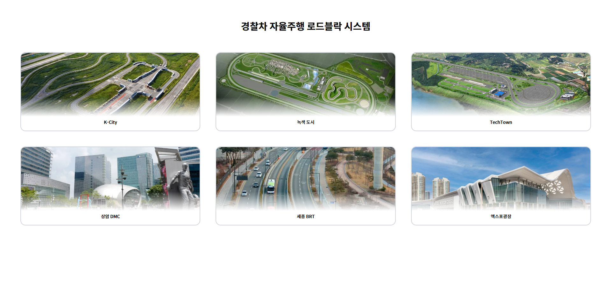
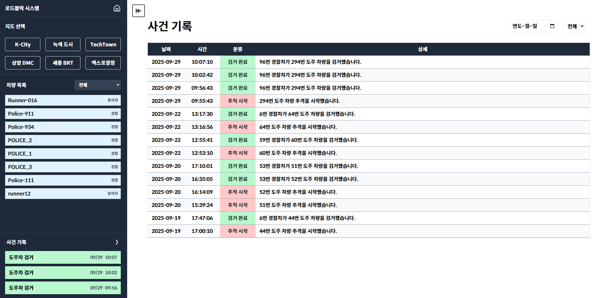
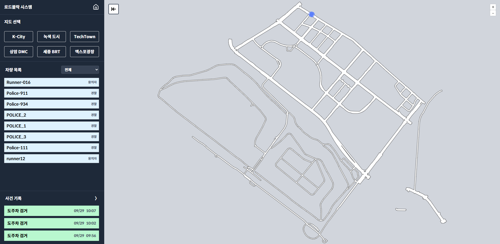

# Road Block - ROS Noetic 기반 도주 차량 추적 자율주행 경찰차 시스템 포팅매뉴얼

Gitlab 소스 클론 이후 빌드 및 배포할 수 있도록 정리한 문서

## 목차
1. [Embedded 실행 가이드](#embedded-실행-가이드)
2. [Frontend 실행 가이드](#frontend-실행-가이드)
3. [Frontend 버전/배포 가이드](#frontend-버전배포-가이드)
4. [Backend 실행 가이드](#backend-실행-가이드)
5. [Backend DB 덤프(SQL)](#backend-db-덤프sql)
6. [시연 순서](#시연-순서)

---

## Embedded 실행 가이드


이 프로젝트는 **Ubuntu 20.04 LTS + ROS Noetic** 환경에서 **MORAI 시뮬레이터**와 연동되는 경찰차 추격 시스템입니다.
공격적 주행 제어를 위해 **A\*** 경로 탐색 + **Pure Pursuit** 제어를 사용합니다.


## 1. 프로젝트 개요 및 폴더 구조

| 파일명 | 역할 |
|---|---|
| `{ 추격 코드 }.py` | A* 경로 탐색 및 Pure Pursuit 기반 추격 주행 제어 |
| `chase_manager.py` | 추격 시작/종료 이벤트 관리 |
| `vehicle_registration.py` | 차량 ID 등록 |
| `vehicle_locate_info.py` | 차량 위치 정보 주기 전송 |
| `vehicle_stat_info.py` | 차량 상태/검거 이벤트 전송 |
| `police_car_*.launch` | 모든 노드 실행 및 네임스페이스/토픽 리맵 |

**폴더 구조**
```
emb/
└── catkin_ws/
 ├── road_block/
 │ ├── launch/
 │ │ └── police_car_*.launch
 │ └── src/
 │ ├── { 추격 코드 }.py
 │ ├── chase_manager.py
 │ ├── vehicle_registration.py
 │ ├── vehicle_locate_info.py
 │ ├── vehicle_stat_info.py
 │ └── map_data/
 │ ├── link_set.json
 │ └── node_set.json
 └── .env
```

---

## ️ 2. 환경 설정

### 2.1 Ubuntu & ROS Noetic
```bash
# 시스템 업데이트
sudo apt update && sudo apt upgrade -y

# ROS 저장소 등록
sudo sh -c 'echo "deb http://packages.ros.org/ros/ubuntu focal main" > /etc/apt/sources.list.d/ros-latest.list'
sudo apt install -y curl
curl -s https://raw.githubusercontent.com/ros/rosdistro/master/ros.asc | sudo apt-key add -

# ROS Noetic 설치
sudo apt update
sudo apt install -y ros-noetic-desktop-full

# 기본 설정 로드
echo "source /opt/ros/noetic/setup.bash" >> ~/.bashrc
source ~/.bashrc

# rosdep
sudo apt install -y python3-rosdep python3-rosinstall python3-rosinstall-generator python3-wstool build-essential
sudo rosdep init
rosdep update
```

### 2.2 Python 의존 패키지
```bash
sudo apt install -y python3-pip
pip3 install numpy scipy python-dotenv websocket-client opencv-python
```

### 2.3 MORAI Simulator & morai_msgs
- MORAI Simulator(라이선스 필요) 설치
- 메시지 패키지 설치:
```bash
cd ~/catkin_ws/src
git clone https://github.com/MORAI/MORAI-Simulator-ROS.git
cd ~/catkin_ws
catkin_make
source devel/setup.bash
```

---

## ️ 3. 프로젝트 설치

### 3.1 Catkin 워크스페이스
```bash
mkdir -p ~/catkin_ws/src
cd ~/catkin_ws
catkin_make
echo "source ~/catkin_ws/devel/setup.bash" >> ~/.bashrc
source ~/.bashrc
```

### 3.2 패키지 생성 & 소스 배치
```bash
cd ~/catkin_ws/src
catkin_create_pkg road_block rospy morai_msgs nav_msgs geometry_msgs std_msgs

mkdir -p ~/catkin_ws/src/road_block/src
mkdir -p ~/catkin_ws/src/road_block/launch

# 여러분의 파일 경로에서 복사
cp [YOUR_FILES_PATH]/*.py ~/catkin_ws/src/road_block/src/
cp [YOUR_FILES_PATH]/police_car_*.launch ~/catkin_ws/src/road_block/launch/
chmod +x ~/catkin_ws/src/road_block/src/*.py
```

### 3.3 HD Map 데이터
```bash
mkdir -p ~/catkin_ws/src/road_block/src/map_data
cp [MAP_DATA_PATH]/link_set.json ~/catkin_ws/src/road_block/src/map_data/
cp [MAP_DATA_PATH]/node_set.json ~/catkin_ws/src/road_block/src/map_data/
```

### 3.4 .env (예: HMAC 키)
```bash
touch ~/catkin_ws/.env
echo "HMAC_SECRET_KEY=[YOUR_HMAC_KEY]" >> ~/catkin_ws/.env
```

---

## 4. ROS 네트워킹 설정 (ROS_MASTER_URI / ROS_IP)

> **전제**: MORAI가 **같은 네트워크**(동일 대역대 IP)에 있는 **Ubuntu(ROS)** 머신과 통신해야 합니다.
> 보통 **Ubuntu 물리 머신/VM**에서 roscore & rosbridge를 띄우고, MORAI에서 해당 **Ubuntu IP와 포트(9090)**로 연결합니다.

### 4.1 내 IP 확인
```bash
ip addr show # 또는
hostname -I # 예) 192.168.0.23
```
여기서 얻은 Ubuntu IP를 `<UBUNTU_IP>`로 사용합니다. (예: `192.168.0.23`)

### 4.2 터미널(세션)별 일시 설정
각 터미널에서 다음 두 줄을 **반드시** 먼저 실행:
```bash
export ROS_MASTER_URI=http://<UBUNTU_IP>:11311
export ROS_IP=<UBUNTU_IP> # 또는 ROS_HOSTNAME=<UBUNTU_IP>
```

### 4.3 영구 설정(선택)
`~/.bashrc` 하단에 추가하면, 새 터미널마다 자동 적용됩니다.
```bash
echo 'export ROS_MASTER_URI=http://<UBUNTU_IP>:11311' >> ~/.bashrc
echo 'export ROS_IP=<UBUNTU_IP>' >> ~/.bashrc
# 또는 echo 'export ROS_HOSTNAME=<UBUNTU_IP>' >> ~/.bashrc
source ~/.bashrc
```

> **TIP**
> - `ROS_IP`와 `ROS_HOSTNAME`은 보통 **둘 중 하나만** 씁니다. IP가 가장 안전합니다.
> - Docker/VM 사용 시 NAT가 아닌 **Bridged(브리지드)** 네트워크로 잡혀야 동일 대역에서 접근 가능합니다.
> - Windows 방화벽이 9090(웹소켓/rosbridge), 11311(ROS master)을 막지 않도록 허용하세요.

---

## 5. 실행 순서 (MORAI + roscore + rosbridge + 패키지)

아래 순서를 **각각 다른 터미널**에서 진행하세요. (터미널 A/B/C 권장)

### 5.1 터미널 A — roscore
```bash
# 환경 설정
source /opt/ros/noetic/setup.bash
export ROS_MASTER_URI=http://<UBUNTU_IP>:11311
export ROS_IP=<UBUNTU_IP>

# ROS master 기동
roscore
```

### 5.2 터미널 B — rosbridge (WebSocket: 9090)
```bash
source /opt/ros/noetic/setup.bash
export ROS_MASTER_URI=http://<UBUNTU_IP>:11311
export ROS_IP=<UBUNTU_IP>

# rosbridge_server 실행 (기본 포트 9090)
roslaunch rosbridge_server rosbridge_websocket.launch
```

> **MORAI 설정**
> - Simulator 내부의 **ROSBridge 연결 설정**에서
> - **IP**: `<UBUNTU_IP>`
> - **Port**: `9090`
> - Connect/On 상태로 전환

### 5.3 터미널 C — Road Block 패키지
```bash
source ~/catkin_ws/devel/setup.bash
export ROS_MASTER_URI=http://<UBUNTU_IP>:11311
export ROS_IP=<UBUNTU_IP>

# 프로젝트 런치 (예: 경찰차 노드들)
roslaunch road_block police_car_*.launch
```

> **시나리오**
> - MORAI에서 경찰차(ID 3) + 도주차(ID 2)가 포함된 시나리오를 실행
> - 연결/시간 동기 후 위 노드들이 차량 등록 → 추격 이벤트 → 제어 순으로 동작

---

## 6. 동작 확인 & 점검

- 토픽 확인
```bash
rostopic list
rostopic echo /rosout
```

- rosbridge 웹소켓 연결 확인(다른 머신에서)
```bash
# 브라우저/스크립트에서 ws://<UBUNTU_IP>:9090 접속 시 정상
```

- 네트워크 기본 점검
```bash
ping <UBUNTU_IP>
nc -zv <UBUNTU_IP> 9090 # rosbridge 포트 열림 확인
nc -zv <UBUNTU_IP> 11311 # roscore 포트 열림 확인
```

## Frontend 실행 가이드

## 폴더 구조

```
frontend/
├── public/ # 정적 파일 디렉토리
│ ├── vite.svg
│ └── image/ # 지도 이미지 리소스
│
├── src/
│ ├── components/ # 공통 컴포넌트
│ │ ├── DashboardLayout.tsx # 대시보드 레이아웃
│ │ ├── InfoEventModal.tsx # 이벤트 알림 모달
│ │ └── TestModal.tsx # 모달 테스트용
│ │
│ ├── features/ # 주요 기능별 컴포넌트
│ │ ├── dashboard/ # 대시보드 관련 컴포넌트
│ │ │ └── components/
│ │ │ ├── ControlSidebar.tsx # 차량 목록 및 필터링 사이드바
│ │ │ ├── VehicleListItem.tsx # 개별 차량 정보 표시 컴포넌트
│ │ │ └── LogListItem.tsx # 로그 항목 표시 컴포넌트
│ │ │
│ │ ├── events/ # 이벤트 로그 관련 컴포넌트
│ │ │ └── components/
│ │ │ ├── EventTable.tsx # 이벤트 로그 테이블 컴포넌트
│ │ │ └── EventRow.tsx # 개별 이벤트 로그 행 컴포넌트
│ │ │
│ │ ├── main/ # 메인 페이지 관련 컴포넌트
│ │ │ ├── MainLanding.tsx # 메인 랜딩 페이지 컴포넌트
│ │ │ ├── MapCard.tsx # 지도 선택 카드 컴포넌트
│ │ │
│ │ └── map/ # 지도 관련 컴포넌트
│ │ └── Components/
│ │ ├── MapView.tsx # OpenLayers 기반 지도 뷰 컴포넌트
│ │ └── VehicleMarker.tsx # 차량 위치 마커 컴포넌트
│ │
│ ├── utils/ # 유틸리티 함수 (시간 관련 UI 표시 정의)
│ ├── stores/ # Zustand 상태관리
│ ├── pages/ # 라우팅 페이지 컴포넌트
│ ├── styles/ # 공통 컴포넌트 CSS 스타일
│ ├── types.ts # TypeScript 타입 정의
│ ├── websockets/ # WebSocket 통신 관련
│ └── Apis.ts # axios 활용 HTTP API 통신
│
├── vite.config.ts # Vite 설정
└── tsconfig.json # TypeScript 설정
```

## 실행 방법

### 개발 환경

```bash
npm install
npm run dev
```

### 프로덕션 빌드

```bash
npm run build
npm run preview
```

### Docker 실행

```bash
docker compose up --build
```

## 환경 변수
 - `VITE_API_BASE` : 백엔드 API 주소
 - `VITE_WS_BASE` : WebSocket 서버 주소

```
VITE_API_BASE=http://api.example.com
VITE_WS_BASE=ws://ws.example.com
```

## 기술 스택

- **언어 및 프레임워크**
 - TypeScript
 - React
 - Vite (빌드/번들링)

- **상태 관리**
 - Zustand

- **스타일링 및 UI**
 - Tailwind CSS
 - Lucide React (아이콘)

- **지도 렌더링**
 - OpenLayers

- **통신**
 - Axios (REST API)
 - WebSocket (실시간 통신)

- **품질 관리**
 - ESLint (코드 품질 검사)

- **운영/배포**
 - Docker (컨테이너 실행)


## 브라우저 지원

본 프로젝트는 최신 ECMAScript(ES2023) 기능과 WebSocket API를 활용합니다.
따라서 다음 환경에서의 실행을 보장합니다:

- Chrome (최신 버전)
- Firefox (최신 버전)
- Safari (최신 버전)
- Edge (최신 버전)

️ Internet Explorer 및 구형 브라우저는 지원하지 않습니다.
구형 브라우저 호환이 필요할 경우, polyfill 설정 또는 `.browserslistrc` 구성을 추가해야 합니다.


# Frontend 버전/배포 가이드

### Building and running your application

When you're ready, start your application by running:
`docker compose up --build`.

Your application will be available at http://localhost:8080.

### Deploying your application to the cloud

First, build your image, e.g.: `docker build -t myapp .`.
If your cloud uses a different CPU architecture than your development
machine (e.g., you are on a Mac M1 and your cloud provider is amd64),
you'll want to build the image for that platform, e.g.:
`docker build --platform=linux/amd64 -t myapp .`.

Then, push it to your registry, e.g. `docker push myregistry.com/myapp`.

Consult Docker's [getting started](https://docs.docker.com/go/get-started-sharing/)
docs for more detail on building and pushing.

### References
* [Docker's Node.js guide](https://docs.docker.com/language/nodejs/)


## Backend 실행 가이드

## 사용한 jvm, 웹서버, was 제품 등의 종류와 설정 값, 버전(IDE버전 포함)
- Python 인터프리터 : Python 3.11.13
- 웹서버 (Web Server): Nginx 1.29.1
- WAS : Uvicorn 0.35.0
- 컨테이너 : Docker Engine 27.5.2
- IDE : Visual Studio Code 1.104.1

## 빌드 시 사용되는 환경 변수 등의 내용
### 서비스 환경 세팅
1. **프로젝트 세팅**
 ```
 .
 ├── .gitlab-ci.yml
 ├── docker-compose.yml
 ├── backend
 │ ├── .env
 │ ├── Dockerfile
 │ ├── requirements.txt
 │ └── app
 │ ├── main.py
 │ ├── db.py
 │ ├── db_sync.py
 │ ├── celery_app.py
 │ └── tasks.py
 ├── frontend
 │ ├── Dockerfile
 │ ├── nginx.conf
 │ └── .env
 └── nginx
 └── default.conf
 ```


2. **환경 변수 설정**
 - `./frontend/.env`
 ```
 # 프로젝트를 세팅한 폴더 경로
 VITE_API_BASE="https://j13a507.p.ssafy.io/api"
 VITE_WS_BASE="wss://j13a507.p.ssafy.io/ws"

 ```
 - `./backend/app/.env`
 ```
 # DB 접속 정보
 DB_HOST=localhost
 DB_PORT=3306
 DB_USERNAME=user
 DB_PASSWORD=password
 DB_NAME=dbname
 DB_SSL_CONFIG = '{"ssl_true": true}'

 # 웹소켓 hmac 생성용 시크릿 키
 HMAC_SECRET_KEY = ""

 # Redis 접속 정보(단, 배포가 아닌 개발 환경에서는 삭제!)
 REDIS_HOST=redis
 ```
## 빌드 및 실행 방법
1. **초기 로컬 개발 환경 가이드**
    - `git pull origin <브랜치명>`
    - `.env` 작성
    - `cd backend`
    - `python -m venv venv` (가상환경 생성)
    - `venv\Scripts\activate` (가상환경 활성화)
    - `pip install -r requirements.txt` (라이브러리 설치)
    - `uvicorn app.main:app --reload` (서버 실행)  

2. **Redis 설치 및 자동 실행 설정 (Ubuntu/WSL)**
    - `sudo apt-get update`
    - `sudo apt-get install redis-server`
    **WSL을 재시작해도 Redis가 자동으로 켜지도록 설정**
        - `sudo systemctl enable redis-server`
    **Redis 최초 실행**
        - `sudo systemctl start redis-server`  

3. **Celery 실행**
    - fastapi 터미널 옆에 추가 터미널 생성
    - `cd backend`
    - `venv\Scripts\activate` (가상환경 활성화)
    - `celery -A app.celery_app worker -P solo --loglevel=info`(Celery 워커 실행)  

4. **서버 종료**
    - `ctrl + C` (서버 종료)
    - `git add .` -> `git commit -m "message"` -> `git push origin <브렌치명>`  

5. **EC2 가이드**
    - `MobaXterm` 접속 및 세션 연결
    - `MobaXterm` 왼쪽 위의 `Session` 버튼을 클릭합니다.
    - 새로 나온 창에서 SSH 아이콘을 클릭합니다.
    - `SSH` 설정 창에서 아래 정보들을 입력합니다.
    - `Remote host`: EC2 인스턴스의 Public IP 주소 또는 도메인 주소(예: j13a507.p.ssafy.io)를 입력합니다.
    - `Specify username`: 체크박스를 선택하고 사용자 이름(예: ubuntu)을 입력합니다.
    - `Advanced SSH settings` 탭을 클릭한 뒤, `Use private key` 옵션을 체크하고, 옆의 파일 아이콘을 눌러 EC2 접속용 `.pem` 키 파일을 선택합니다.
    - OK 버튼을 누르면 세션이 생성되고 자동으로 서버에 접속됩니다.
    - `User Sessions`에 생성된 세션에 접속, git pull 한 파일 좌측 home/ubuntu/ 경로에 붙여넣기
    - `python3.11 -m venv <가상환경 이름>` (가상환경 생성) **주의!!** 반드시 `python3.11` 이걸로 생성해야 합니다! 아니면 `pip install` 안됩니다!!
    - `source <가상환경 이름>/bin/activate` (새로운 가상환경 실행)
    - `pip install -r requirements.txt` (라이브러리 설치)
    - `sudo /home/ubuntu/S13P21A507/backend/<가상환경 이름>/bin/uvicorn app.main:app --host 0.0.0.0 --port <개인 개발 포트>`(서버 실행)  
6. **EC2 celery 설정**
    - `backend/app/.env`에서 `REDIS_HOST=redis` 삭제
    - 동일한 세션의 터미널 추가
    - `cd backend`
    - `source <가상환경 이름>/bin/activate` (새로운 가상환경 실행)
    - `celery -A app.celery_app worker --loglevel=info`(Celery 워커 실행)  
7. **EC2 서버 종료**
    - `ctrl + C` (서버 종료, 2개의 터미널 모두 종료)  

8. **서비스 배포**
    - `CI (Continuous Integration)`: 이미지 자동 빌드 및 푸시
    - 개발자가 로컬 PC에서 git push를 실행하면, GitLab의 CI 파이프라인이 자동으로 실행됩니다. 이 파이프라인은 최신 코드를 기반으로 새로운 Docker 이미지를 빌드하고, EC2 서버 내 `Private Registry`에 저장(push)합니다.

    - `CD (Continuous Deployment)`: 서비스 수동 배포
    - 서버 관리자가 EC2 서버에 접속하여, 아래의 `docker-compose` 명령어들을 순서대로 실행하여 수동으로 서비스를 업데이트합니다.

    - `docker-compose pull`
        Private Registry에 저장된 최신 이미지를 서버로 가져옵니다.

    - `docker-compose down`
        현재 실행 중인 구버전의 컨테이너를 안전하게 중지하고 삭제합니다.

    - `docker-compose up -d`
        방금 내려받은 최신 이미지로 새로운 컨테이너를 백그라운드에서 실행합니다.  


## DB 접속 정보 등 프로젝트(ERD)에 활용되는 주요 계정 및 프로퍼티가 정의된 파일 목록
### .env
- 데이터베이스 접속 정보(사용자, 비밀번호, 호스트, 포트) 등 모든 민감 정보를 정의하는 파일입니다. 이 파일은 .gitignore에 추가하여 Git 저장소에 포함되지 않도록 관리합니다.

### app/db.py
- .env 파일의 변수를 읽어 FastAPI의 비동기 이벤트 루프와 함께 동작하는 비동기 데이터베이스 엔진과 세션을 생성하고, 앱 전체에 DB 연결을 제공합니다.

### app/db_sync.py
- .env 변수를 읽어 Celery 워커와 같은 동기 환경을 위한 DB 엔진과 세션을 생성합니다. 비동기 환경인 FastAPI와 격리된 DB 연결을 제공하기 위해 별도로 존재합니다.

### app/celery_app.py
- Celery 애플리케이션의 설정을 담당하는 중심 파일입니다. 메시지 브로커(Broker)와 결과 백엔드(Backend)로 Redis를 사용하도록 지정하며, app.tasks와 같은 파일에 정의된 함수들이 Task로 등록될 수 있도록 Celery 인스턴스를 생성하고 제공합니다.

### app/tasks.py
- 실제 백그라운드에서 처리될 작업의 로직이 정의된 파일입니다. Celery 워커는 이 파일에 정의된 함수들을 실행하여 DB 저장과 같은 시간이 걸리는 작업을 처리합니다.

### Dockerfile
- 컨테이너 이미지를 생성하기 위한 설계도 또는 레시피 파일입니다. 각 서비스(프론트엔드, 백엔드)가 독립된 환경에서 일관되게 동작할 수 있도록 필요한 모든 설정과 명령을 정의합니다.

### docker-compose.yml
- backend, frontend, nginx 등 프로젝트를 구성하는 모든 서비스를 정의하고 연결합니다. 특히, env_file 속성을 통해 .env 파일의 내용을 각 서비스 컨테이너의 환경 변수로 주입하는 역할을 합니다.

### nginx/default.conf
- 프로젝트의 메인 리버스 프록시 역할을 수행합니다. 외부의 모든 HTTP/HTTPS 요청(port 80, 443)을 최초로 받아, 경로에 맞춰 적절한 내부 서비스 컨테이너(백엔드, 프론트엔드)로 전달하는 게이트웨이입니다.

### frontend/nginx.conf
- 프론트엔드 Docker 컨테이너 내부에서 실행되는 Nginx의 설정 파일입니다. 빌드된 정적 파일(HTML, CSS, JS)을 제공하고, SPA(Single Page Application)의 라우팅이 새로고침 시에도 정상 작동하도록 모든 요청을 index.html로 리다이렉트하는 역할을 합니다.


---

## Backend DB 덤프(SQL)

```sql
-- MySQL dump 10.13 Distrib 8.0.43, for Win64 (x86_64)
--
-- Host: ssafy-mysql-db.mysql.database.azure.com Database: s13p21a507
-- ------------------------------------------------------
-- Server version	8.0.42-azure

/*!40101 SET @OLD_CHARACTER_SET_CLIENT=@@CHARACTER_SET_CLIENT */;
/*!40101 SET @OLD_CHARACTER_SET_RESULTS=@@CHARACTER_SET_RESULTS */;
/*!40101 SET @OLD_COLLATION_CONNECTION=@@COLLATION_CONNECTION */;
/*!50503 SET NAMES utf8 */;
/*!40103 SET @OLD_TIME_ZONE=@@TIME_ZONE */;
/*!40103 SET TIME_ZONE='+00:00' */;
/*!40014 SET @OLD_UNIQUE_CHECKS=@@UNIQUE_CHECKS, UNIQUE_CHECKS=0 */;
/*!40014 SET @OLD_FOREIGN_KEY_CHECKS=@@FOREIGN_KEY_CHECKS, FOREIGN_KEY_CHECKS=0 */;
/*!40101 SET @OLD_SQL_MODE=@@SQL_MODE, SQL_MODE='NO_AUTO_VALUE_ON_ZERO' */;
/*!40111 SET @OLD_SQL_NOTES=@@SQL_NOTES, SQL_NOTES=0 */;

--
-- Table structure for table `event`
--

DROP TABLE IF EXISTS `event`;
/*!40101 SET @saved_cs_client = @@character_set_client */;
/*!50503 SET character_set_client = utf8mb4 */;
CREATE TABLE `event` (
 `event_id` int NOT NULL AUTO_INCREMENT,
 `catcher_id` int DEFAULT NULL,
 `runner_id` int NOT NULL,
 `status` enum('RUN','CATCH','FAILED') COLLATE utf8mb4_bin NOT NULL,
 `created_at` datetime NOT NULL DEFAULT (now()),
 PRIMARY KEY (`event_id`),
 KEY `catcher_id` (`catcher_id`),
 KEY `runner_id` (`runner_id`),
 CONSTRAINT `event_ibfk_1` FOREIGN KEY (`catcher_id`) REFERENCES `vehicle` (`id`),
 CONSTRAINT `event_ibfk_2` FOREIGN KEY (`runner_id`) REFERENCES `vehicle` (`id`)
) ENGINE=InnoDB AUTO_INCREMENT=126 DEFAULT CHARSET=utf8mb4 COLLATE=utf8mb4_bin;
/*!40101 SET character_set_client = @saved_cs_client */;

--
-- Dumping data for table `event`
--

LOCK TABLES `event` WRITE;
/*!40000 ALTER TABLE `event` DISABLE KEYS */;
INSERT INTO `event` VALUES (24,NULL,44,'RUN','2025-09-19 08:00:10'),(32,6,44,'CATCH','2025-09-19 08:47:06'),(36,NULL,51,'RUN','2025-09-20 06:39:24'),(37,NULL,52,'RUN','2025-09-20 07:14:09'),(38,53,52,'CATCH','2025-09-20 07:35:05'),(40,53,51,'CATCH','2025-09-20 08:10:01'),(46,NULL,60,'RUN','2025-09-22 03:53:10'),(47,59,60,'CATCH','2025-09-22 03:55:41'),(51,NULL,64,'RUN','2025-09-22 04:16:56'),(52,59,64,'CATCH','2025-09-22 04:18:00');
/*!40000 ALTER TABLE `event` ENABLE KEYS */;
UNLOCK TABLES;

--
-- Table structure for table `map`
--

DROP TABLE IF EXISTS `map`;
/*!40101 SET @saved_cs_client = @@character_set_client */;
/*!50503 SET character_set_client = utf8mb4 */;
CREATE TABLE `map` (
 `map_id` int NOT NULL AUTO_INCREMENT,
 `map_name` varchar(100) COLLATE utf8mb4_bin NOT NULL,
 `description` varchar(255) COLLATE utf8mb4_bin DEFAULT NULL,
 `created_at` datetime NOT NULL DEFAULT (now()),
 PRIMARY KEY (`map_id`),
 UNIQUE KEY `ix_map_map_name` (`map_name`)
) ENGINE=InnoDB DEFAULT CHARSET=utf8mb4 COLLATE=utf8mb4_bin;
/*!40101 SET character_set_client = @saved_cs_client */;

--
-- Dumping data for table `map`
--

LOCK TABLES `map` WRITE;
/*!40000 ALTER TABLE `map` DISABLE KEYS */;
/*!40000 ALTER TABLE `map` ENABLE KEYS */;
UNLOCK TABLES;

--
-- Table structure for table `policecar`
--

DROP TABLE IF EXISTS `policecar`;
/*!40101 SET @saved_cs_client = @@character_set_client */;
/*!50503 SET character_set_client = utf8mb4 */;
CREATE TABLE `policecar` (
 `vehicle_id` int NOT NULL,
 `fuel` int NOT NULL,
 `collision_count` int NOT NULL,
 `status` enum('NORMAL','HALF_DESTROYED','COMPLETE_DESTROYED') COLLATE utf8mb4_bin NOT NULL,
 PRIMARY KEY (`vehicle_id`),
 CONSTRAINT `policecar_ibfk_1` FOREIGN KEY (`vehicle_id`) REFERENCES `vehicle` (`id`)
) ENGINE=InnoDB DEFAULT CHARSET=utf8mb4 COLLATE=utf8mb4_bin;
/*!40101 SET character_set_client = @saved_cs_client */;

--
-- Dumping data for table `policecar`
--

LOCK TABLES `policecar` WRITE;
/*!40000 ALTER TABLE `policecar` DISABLE KEYS */;
INSERT INTO `policecar` VALUES (6,60,1,'HALF_DESTROYED'),(53,80,1,'HALF_DESTROYED'),(59,0,2,'COMPLETE_DESTROYED'),(95,0,0,'NORMAL'),(96,0,1,'HALF_DESTROYED'),(97,62,0,'NORMAL'),(107,100,0,'NORMAL');
/*!40000 ALTER TABLE `policecar` ENABLE KEYS */;
UNLOCK TABLES;

--
-- Table structure for table `vehicle`
--

DROP TABLE IF EXISTS `vehicle`;
/*!40101 SET @saved_cs_client = @@character_set_client */;
/*!50503 SET character_set_client = utf8mb4 */;
CREATE TABLE `vehicle` (
 `id` int NOT NULL AUTO_INCREMENT,
 `vehicle_id` int NOT NULL,
 `car_name` varchar(50) COLLATE utf8mb4_bin NOT NULL,
 `vehicle_type` enum('POLICE','RUNNER') COLLATE utf8mb4_bin NOT NULL,
 `created_at` datetime NOT NULL DEFAULT (now()),
 `deleted_at` datetime DEFAULT NULL,
 PRIMARY KEY (`id`),
 UNIQUE KEY `ix_vehicle_vehicle_id` (`vehicle_id`),
 UNIQUE KEY `ix_vehicle_car_name` (`car_name`)
) ENGINE=InnoDB AUTO_INCREMENT=221 DEFAULT CHARSET=utf8mb4 COLLATE=utf8mb4_bin;
/*!40101 SET character_set_client = @saved_cs_client */;

--
-- Dumping data for table `vehicle`
--

LOCK TABLES `vehicle` WRITE;
/*!40000 ALTER TABLE `vehicle` DISABLE KEYS */;
INSERT INTO `vehicle` VALUES (6,123,'Police1','POLICE','2025-09-10 06:38:49',NULL),(44,9901,'Runner-112','RUNNER','2025-09-19 08:00:10','2025-09-19 06:58:30'),(51,9915,'Runner-015','RUNNER','2025-09-20 06:39:24',NULL),(52,9916,'Runner-016','RUNNER','2025-09-20 07:14:09',NULL),(53,9119,'Police-911','POLICE','2025-09-20 07:15:48',NULL),(59,9334,'Police-934','POLICE','2025-09-22 03:49:15',NULL),(60,1139,'Runner-113','RUNNER','2025-09-22 03:53:10','2025-09-19 06:58:30'),(64,9999,'Runner-900','RUNNER','2025-09-22 04:16:56','2025-09-19 06:58:30'),(95,3,'POLICE_2','POLICE','2025-09-22 08:16:41',NULL),(96,0,'POLICE_1','POLICE','2025-09-22 08:16:41',NULL),(97,4,'POLICE_3','POLICE','2025-09-22 08:16:41',NULL),(107,1111,'Police-111','POLICE','2025-09-23 04:27:40','2025-09-25 08:24:12');
/*!40000 ALTER TABLE `vehicle` ENABLE KEYS */;
UNLOCK TABLES;

--
-- Table structure for table `vehiclelocation`
--

DROP TABLE IF EXISTS `vehiclelocation`;
/*!40101 SET @saved_cs_client = @@character_set_client */;
/*!50503 SET character_set_client = utf8mb4 */;
CREATE TABLE `vehiclelocation` (
 `location_id` int NOT NULL AUTO_INCREMENT,
 `vehicle_id` int NOT NULL,
 `position_x` float NOT NULL,
 `position_y` float NOT NULL,
 `created_at` datetime NOT NULL DEFAULT (now()),
 PRIMARY KEY (`location_id`),
 KEY `vehicle_id` (`vehicle_id`),
 CONSTRAINT `vehiclelocation_ibfk_1` FOREIGN KEY (`vehicle_id`) REFERENCES `vehicle` (`id`)
) ENGINE=InnoDB AUTO_INCREMENT=42647 DEFAULT CHARSET=utf8mb4 COLLATE=utf8mb4_bin;
/*!40101 SET character_set_client = @saved_cs_client */;

--
-- Dumping data for table `vehiclelocation`
--

LOCK TABLES `vehiclelocation` WRITE;
/*!40000 ALTER TABLE `vehiclelocation` DISABLE KEYS */;
/*!40000 ALTER TABLE `vehiclelocation` ENABLE KEYS */;
UNLOCK TABLES;

--
-- Dumping events for database 's13p21a507'
--

--
-- Dumping routines for database 's13p21a507'
--
/*!40103 SET TIME_ZONE=@OLD_TIME_ZONE */;

/*!40101 SET SQL_MODE=@OLD_SQL_MODE */;
/*!40014 SET FOREIGN_KEY_CHECKS=@OLD_FOREIGN_KEY_CHECKS */;
/*!40014 SET UNIQUE_CHECKS=@OLD_UNIQUE_CHECKS */;
/*!40101 SET CHARACTER_SET_CLIENT=@OLD_CHARACTER_SET_CLIENT */;
/*!40101 SET CHARACTER_SET_RESULTS=@OLD_CHARACTER_SET_RESULTS */;
/*!40101 SET COLLATION_CONNECTION=@OLD_COLLATION_CONNECTION */;
/*!40111 SET SQL_NOTES=@OLD_SQL_NOTES */;

-- Dump completed on 2025-09-26 10:12:06

```


---


## 시연 순서

1. Web 대시보드 시연




2. 시나리오 시작